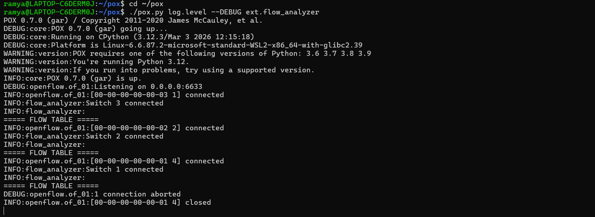
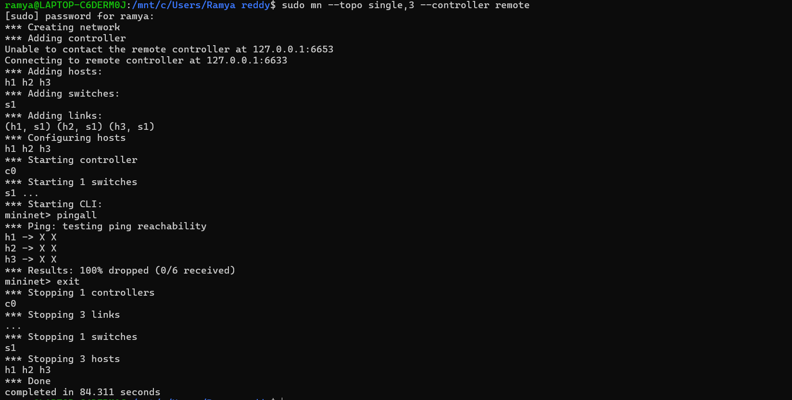

# SDN Flow Analyzer

A Software Defined Networking (SDN) mini project using the POX controller to monitor OpenFlow switch flow statistics in real time.

## Features

- Detects OpenFlow switch connections
- Requests and analyzes flow statistics
- Identifies active and unused flow rules
- Displays packet count information
- Uses POX controller with Mininet
- Runs on WSL (Windows Subsystem for Linux)

---

## Technologies Used

- Python
- POX Controller
- OpenFlow Protocol
- Mininet
- WSL (Ubuntu)

---

## Project Structure

```text
flow_analyzer
 ├── flow_analyzer.py
 ├── README.md
 ├── terminal1.png
 └── terminal2.png
```

---

## How It Works

1. The POX controller listens for switch connections.
2. Mininet creates a virtual network topology.
3. The controller requests flow statistics from switches.
4. Flow entries are analyzed using packet counts.
5. Rules are classified as:
   - ACTIVE
   - UNUSED

---

## Requirements

- Ubuntu / WSL
- Python 3
- POX Controller
- Mininet

---

## Installation

### Clone POX

```bash
git clone https://github.com/noxrepo/pox.git
```

### Install Mininet

```bash
sudo apt update
sudo apt install mininet
```

---

## Running the Project

### Terminal 1 — Run POX Controller

```bash
cd ~/pox
./pox.py log.level --DEBUG ext.flow_analyzer
```

### Terminal 2 — Run Mininet

```bash
sudo mn --topo single,3 --controller remote
```

Generate traffic:

```bash
pingall
```

---

## Output

### Terminal 1 — POX Controller



---

### Terminal 2 — Mininet Output



---
