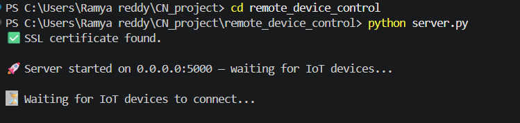
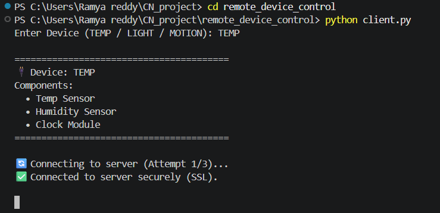
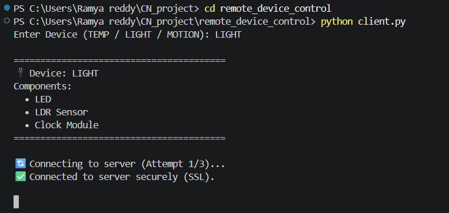
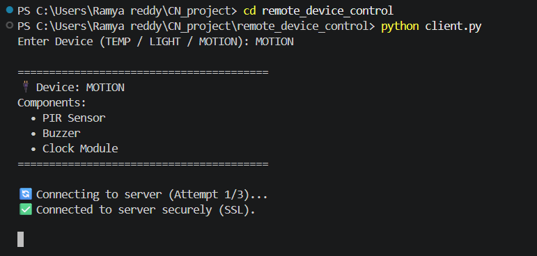
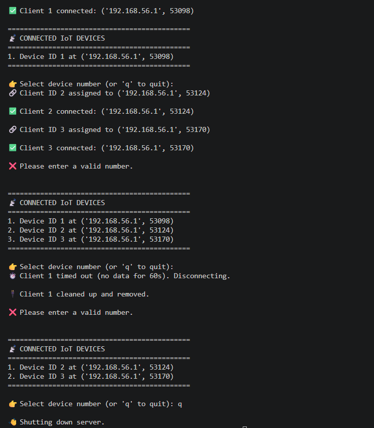

# Secure Remote Device Control System

A Computer Networks mini project that demonstrates secure communication between multiple IoT devices and a central server using Python sockets and SSL/TLS encryption.

---

## Features

- Secure SSL/TLS encrypted communication
- Multi-client device support
- IoT device simulation
- Real-time command handling
- Automatic SSL certificate generation
- Threaded client management
- Device-specific responses
- Robust error handling

---

## Supported Devices

### TEMP Device
- Temperature Sensor
- Humidity Sensor

### LIGHT Device
- LED Control
- Brightness Monitoring

### MOTION Device
- PIR Motion Detection
- Buzzer Control

---

## Technologies Used

- Python
- Socket Programming
- SSL/TLS
- Multithreading
- Computer Networks Concepts

---

## Project Structure

```text
remote_device_control
 ├── client.py
 ├── server.py
 ├── server.crt
 ├── server.key
 ├── README.md
 ├── server_start.png
 ├── final_output.png
 ├── temp_client.png
 ├── light_client.png
 └── motion_client.png
```

---

## How It Works

1. The server starts and waits for IoT device connections.
2. Devices connect securely using SSL/TLS.
3. The server sends commands such as:
   - STATUS
   - DATA
   - TIME
   - ON
   - OFF
4. Devices process commands and send responses securely.
5. Multiple IoT devices can connect simultaneously.

---

## Requirements

- Python 3
- OpenSSL
- Windows / Linux / WSL

---

## Running the Project

### Terminal 1 — Start Server

```bash
python server.py
```

### Terminal 2 — Start TEMP Device

```bash
python client.py
```

Enter:

```text
TEMP
```

---

### Terminal 3 — Start LIGHT Device

```bash
python client.py
```

Enter:

```text
LIGHT
```

---

### Terminal 4 — Start MOTION Device

```bash
python client.py
```

Enter:

```text
MOTION
```

---

## Output

### Server Initialization



---

### TEMP Device Client



---

### LIGHT Device Client



---

### MOTION Device Client



---

### Final Communication Output



---

## Failure Scenarios Handled

- SSL handshake failure
- Invalid device selection
- Connection timeout
- Server disconnect
- Corrupt data handling
- Empty commands
- Network failure
- Client crash recovery
- Retry connection logic
